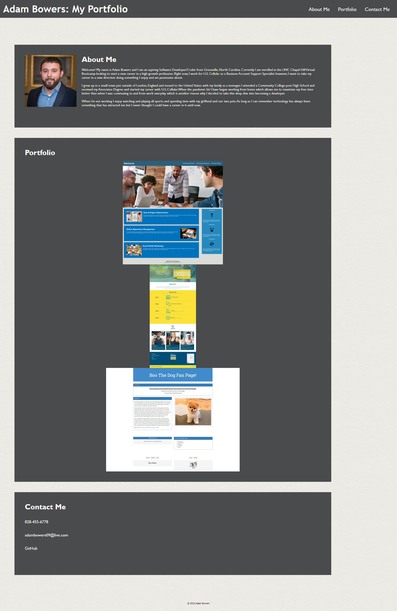

# My Portfolio
A simple portfolio with a breif bio, screenshots of some of my current work, along with contact information.

## Description
This challenge was to create a basic three-section portfolio using HTML and CSS.

Features
* Responsive layout
* Semantic HTML
* Sticky header & navbar
* Link to my GitHub repo & LinkedIn

## Links
[Link to the website](https://adambowers09.github.io/My-Portfolio/)

[Link to code repo](https://github.com/adambowers09/my-basic-portfolio)

## Screenshot

